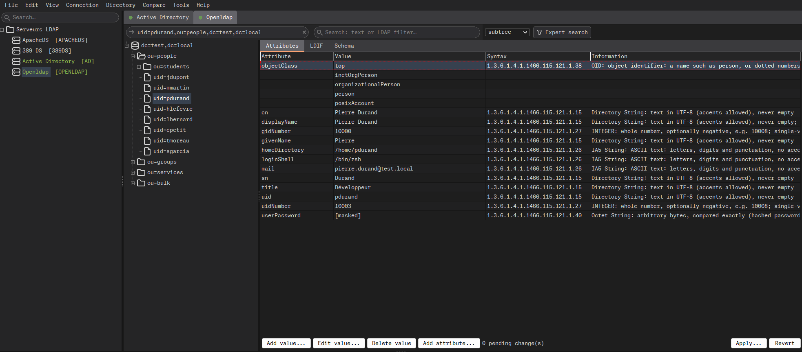
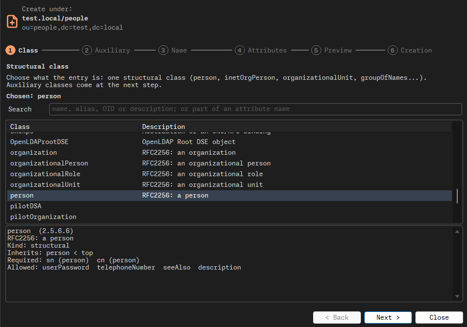
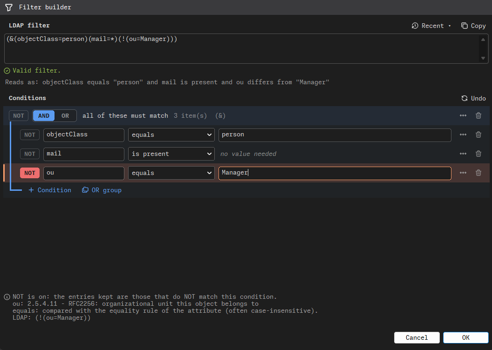
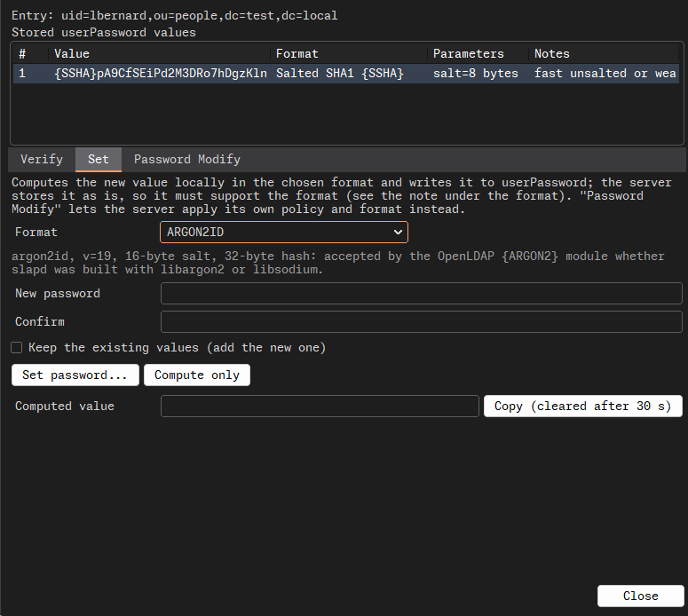
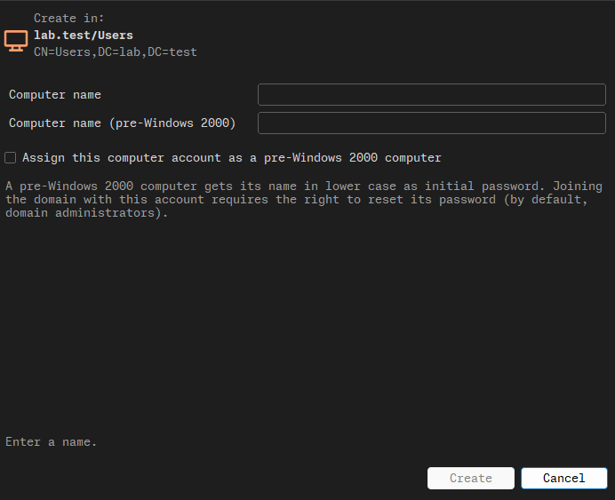

# Rottentree

> A rotten tree for directories nobody has pruned since 2011.

An LDAP and Active Directory administration client for Windows, Linux and
macOS, written in Free Pascal / Lazarus, a stack that has outlived most of the
frameworks that were supposed to bury it, and attended several of their
funerals. The name is the only rotten part. The rest was written by someone who
once restored a directory from backup and found out, on that day and not
before, what the backup actually contained.

That tree holds fourteen users. Real directories hold fourteen thousand in a
single OU, created by a script in 2011 by someone who left in 2012. Two of them
are dead, three of them are still enabled, and one is a service account whose
password has not changed since the script ran, because nobody knows what stops
working if it does. Rottentree copes with all of it, and judges none of it out
loud.

## Why

LDAP clients come in three families. The one that needs more memory than the
directory it administers, and wants to update its runtime while the domain
controller is on fire. The web one, which wants a PHP server standing between
you and every password in the company, exposed to the network so that you can
reach it from anywhere, like everybody else. And `ldapsearch -x -H ... -D ...
-W -b ...`, typed from memory, with the shell history keeping the bind DN as a
souvenir for whoever gets your laptop next.

Rottentree is a native application that starts in under a second, does not
want an account, and talks to nothing but the directories you configured: no
telemetry, no "help us improve", no update check phoning home to report that
you opened the domain controller again at 3 a.m. It reads freely and writes
reluctantly, like a good auditor. New profiles are read-only until you say
otherwise, and nothing is ever written until you have seen exactly what is
about to be sent. It cannot stop you from doing something stupid. It only
makes sure you do it on purpose.

## What it does

**One encrypted file.** Connection profiles, folders, saved searches,
comparisons and whatever passwords you chose to remember live in a single
`.rtt` document, encrypted with Argon2id and XChaCha20-Poly1305. Passwords are
not remembered unless you ask. Lose the file on a train and whoever finds it
gets a long, warm winter of running their graphics card against it, and nothing
else. Forget the master password and you get exactly the same deal: that is
the point, and from then on it is also your problem. Saving is atomic: pull the
plug mid-save and you get yesterday's version back, not a perfectly encrypted
empty file.

**Connections.** Plain LDAP, StartTLS or LDAPS, TLS 1.2 at the very least.
Certificates are checked for real: chain, dates and host name. The self-signed
certificate of the lab server, the one that expired in 2019 and that everybody
clicks through, can be trusted for that profile only, after you have looked at
its fingerprint, and the status bar keeps reminding you that you did. A failed
TLS negotiation closes the connection. It never quietly retries in clear text,
because "it worked" and "your password just crossed the network in clear" look
exactly alike until the audit, or the breach, whichever comes first. Sending a
password over a plain connection is possible, on purpose, per profile, with a
warning that does not go away. Anonymous, simple bind and SASL EXTERNAL with a
client certificate. *Append base DN* lets you type `cn=admin` instead of the
full DN, like a person, rather than like a person who has typed `dc=` four
hundred times today.

**The tree.** Loaded one level at a time, and only when you open it. A level
with fifty thousand children, the classic `ou=people` from which nobody has ever
been removed, not even the deceased, is cut into ranges instead of freezing the
window and the server's patience at the same time. If your account can read
the server's own configuration (`cn=config`, `cn=monitor`, the Active Directory
configuration and schema partitions), it appears in the tree too, labelled as
such, and any change there comes with a warning that it applies at once and
can take the server down with it, and your weekend with the server.

**Editing.** Attributes with their syntax explained in plain words, editors
that know a date from a DN, multi-valued attributes, binary values in hex.
Changes wait in a buffer, and *Apply* shows the exact operations before
anything leaves: the last moment in the life of a change when it can still be
called a draft. When the server supports it, a write only lands if the entry
has not changed since you read it; otherwise the entry is read again right
before, because a colleague editing the same group at the same time is not a
theory. When the connection drops after a request has left, Rottentree says
*outcome unknown* instead of guessing, and it never replays a write on its own:
a retried `delete` is a fine way to find out whether the first one worked.
Create, rename, move, copy a branch to another server, delete a subtree
leaves-first after showing you how many entries that actually is. It is always
more than you thought.

**Search.** Plain text or an LDAP filter, scope, attributes, paged results,
saved searches, and a filter builder for the evenings when you can no longer
remember where the parentheses go in a negation, and the filter that was
supposed to exclude the managers now selects only them. *0 results* is only
shown as such once the server has actually finished answering, not when it hit
a size limit and went quiet, which is when *0 results* starts meaning "some".

**LDIF.** Import with a plan you can read before running it, export of an
entry, a branch or a search. An LDIF file can also be opened as if it were a
server: tree, search, edit, save, and copy branches between the file and a
live directory in both directions. Useful for checking what a 40 MB export
really contains before feeding it to a production server, which would happily
accept the first thirty thousand entries and choke on the rest, at 2 a.m., with
no way back but the export you did not make.

**Passwords.** Reads, recognises and checks `userPassword` values: `{SSHA}` and
its SHA-2 cousins, `{CRYPT}` with MD5-crypt, SHA-crypt or bcrypt, the PBKDF2
dialects of OpenLDAP and 389 DS, and `{ARGON2}` as OpenLDAP builds it with
libargon2 or with libsodium, which do not accept the same values, and
Rottentree tells you which one will choke on which. It also flags the values
still sitting on a fast, unsalted or weak digest, so you know exactly which
accounts to worry about, and roughly since which decade. Generates new ones,
`{SASL}` identities included. Decrypts nothing, since there is nothing to
decrypt, which is the point. If you were hoping to
recover the director's password, you have the wrong tool, and possibly the
wrong job.

**Active Directory.** A domain dashboard, default and fine-grained password
policies, account states (disabled, locked out, must change password, never
expires) changed without touching the unrelated bits of `userAccountControl`,
so that unlocking an intern does not also turn them into a domain controller.
User and group creation, protection against accidental deletion set the same
way the Microsoft console sets it, security descriptors rendered for humans,
and per-attribute replication metadata for the afternoon two domain
controllers disagree about who someone is, and both are absolutely certain.

**Comparison.** From 2 to 16 directories or LDIF files compared entry by entry,
with the differences sorted, explained and exported as HTML, JSON or CSV.
Sixteen replicas in perfect agreement is a beautiful sight, and you will see it
roughly as often as an eclipse. The CSV export neutralises cells a spreadsheet
would execute as formulas: a `description` starting with `=` is a joke the
first time and an incident the second.

**Monitoring.** `cn=monitor` counters and 389 DS replication agreements,
refreshed only while you are looking at them. A counter that cannot be read
shows as unknown, never as zero: zero errors and no idea are not the same
statement, however much the weekly report would prefer the first one.

**Tools.** Schema browser, Root DSE inspector (what the server actually
supports, as opposed to what the slide deck said), certificate inspector, DN
and filter escaping for the colleague called O'Brien, profile export and
import.

Tested against OpenLDAP, 389 Directory Server, ApacheDS and Active Directory,
each of which reads the RFCs with the same creativity and none of the same
conclusions.

## Getting it

Packages for all three systems are on the
[releases page](https://github.com/clamy54/Rottentree/releases): an installer
for Windows, a `.deb` for Debian and Ubuntu, a `.dmg` for macOS, all built
automatically from this repository rather than on somebody's laptop at the end
of a long week. None is signed by anyone a corporation would vouch for, so
Windows and macOS will both warn you that this software is not to be trusted
(*More info > Run anyway* on Windows, *Privacy & Security > Open Anyway* on
macOS). They are working as designed, and they have a point: you are about to
hand the keys of your directory to a program written by a stranger. Read the
source first. Nobody does, but it is there. To build it yourself, see
[`BUILD.md`](BUILD.md).

## Third parties

Rottentree stands on the shoulders of the OpenLDAP client libraries, OpenSSL,
Cyrus SASL, libsodium, SQLite, Argon2, Lazarus and Free Pascal, plus the
Monaspace and JetBrains Mono fonts and the Tabler icons, all listed with their
licenses in
[`licenses/THIRD-PARTY-NOTICES.md`](licenses/THIRD-PARTY-NOTICES.md). Those are
the people who did the hard part. Bugs, on the other hand, are probably mine.

## License

GPL-3.0-or-later, see [`LICENSE`](LICENSE). No warranty, as the license
explains at some length and in capital letters. If this software deletes an OU
the day before an audit, you have the source, you have the LDIF export you
made beforehand (you made one), and you have my sincere condolences, in that
order. If you did not make one, you only have the condolences.

(c) 2023-2026 Cyril LAMY.
